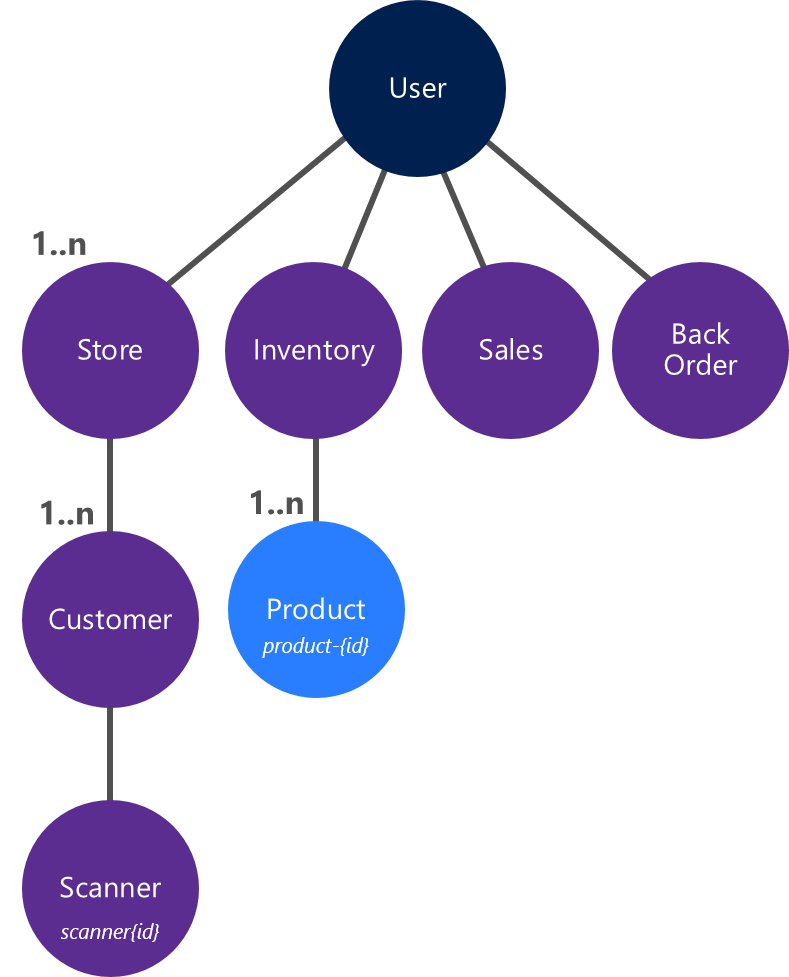

# Akka.NET - Warehouse Sample
This is a sample application demonstrating some aspects of Akka.NET. I use this application for demos during talks I give on Building Actor Model systems using Akka.NET.

This repo contains 3 folders:

| Folder      | Description                                                                                             |
|:------------|:--------------------------------------------------------------------------------------------------------|
| Start       | The base demo with all actors running in 1 single process.                                              |
| Remoting    | The demo with the sales actor running in a remote process (demonstrating Akka.Remoting).                |
| Persistence | The demo with the sales actor persisting state in Azure Table storage (demonstrating Akka.Persistence). | 

## Demo description
This application simulates a central warehouse system with multiple stores that allow customers to scan products in order to purchase them. The system consists of the following parts:

* Inventory - keeps track of the amount of products in stock.
* Sales - keeps track of how many money the company has made on sales.
* Backorder - keeps track of products which need to be back-ordered (because of insufficient stock).
* Store - keeps tracks of scanners being used by customers in the store.
* Scanners - represent bar-code scanners used by customers to purchase products (by scanning them and entering an amount).

## Actor Hierarchy
The following Actor hierarchy is used in the system:

For every store a *Store* actor is created. The store actor creates a *Customer* actor per customer. Every customer actor creates a *Scanner* actor to represent the a barcode scanner. In this demo, customers with a scanner are simulated by letting the customer actor repeatedly send a scheduled message to *Self* at random intervals.

The *Inventory* actor creates a *Product* actor per available product in the inventory. I chose this solution in order to serialize access to the product stock-amount (state) by multiple customers. In the initial design, I did this by letting the single InventoryActor handle this. This worked but introduced a bottle-neck at the InventoryActor (mailbox filled up) and increased the response-times which was bad for the customers. 

The *Sales* actor accumulates all sales. Only products actually sold are added - back-ordered products will not show up in the sales report.

The *BackOrder* actor tracks the list of products that must be back-ordered because of insufficient stock.

## Start Solution
The *Start* solution contains the initial version of the demo application. All actors run in a single process. This process is the *Warehouse* console application. When this project is started, the application initializes and waits for a keypress before starting a simulation. By default, only 1 store with 1 customer is simulated. You can increase this by setting the following variables:

* *numberOfStores* in *Program.cs* in the *Warehouse* project. 
* *_numberOfCustomers* in *StoreActor.cs* in the *Actors* project.

Throughout the simulationinformation about what's going on is printed to the console. I've used different colors to identify which actor prints the message:

| Color     | Emitted by        |
|:----------|:------------------|
| White     | Store actor       |
| Yellow    | Scanner actor     |
| Green     | Product actor     |
| Cyan      | Sales actor       |
| Red       | BackOrder actor   |
